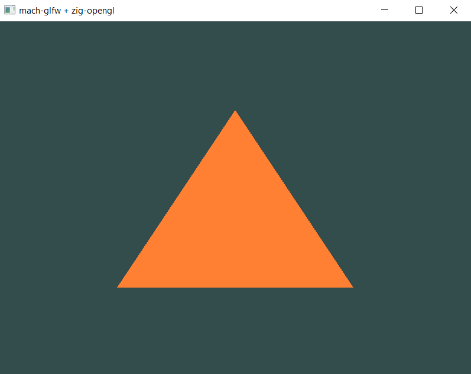
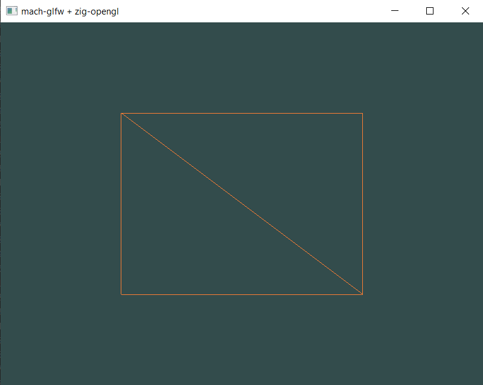
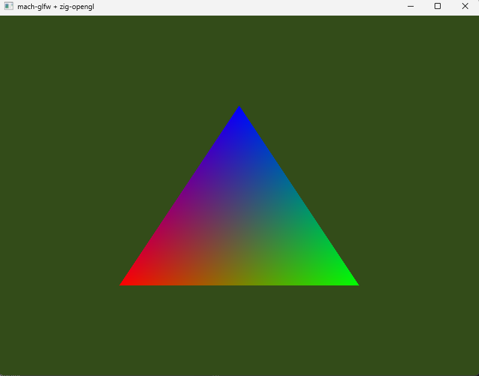
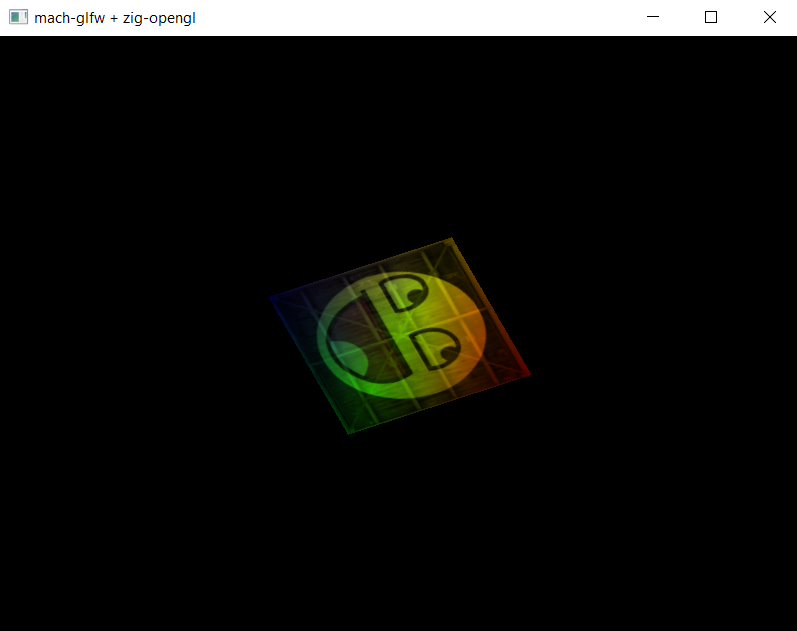
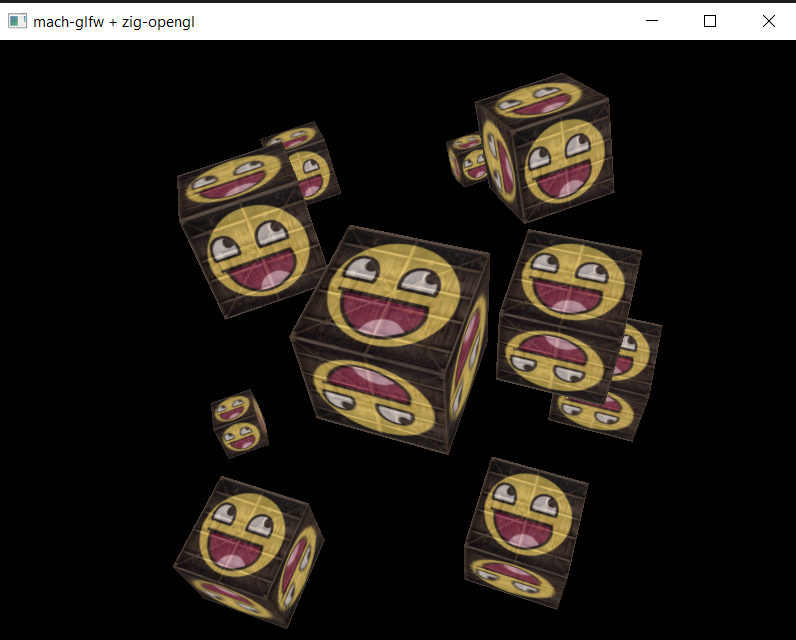

# [**Learn OpenGL**](https://learnopengl.com/) using [Zig](https://ziglang.org/).

Windowing library: [mach/glfw - Ziggified GLFW bindings](https://github.com/hexops/mach-glfw) by slimsag
(Stephen Gutekanst).

OpenGL bindings for Zig were generated by the [zig-opengl](https://github.com/MasterQ32/zig-opengl) project by MasterQ32 (Felix Queißner).

[zstbi](https://github.com/michal-z/zig-gamedev/tree/main/libs/zstbi) - stb image bindings, [zmath](https://github.com/michal-z/zig-gamedev/tree/main/libs/zmath) - SIMD math library, provided by [Michal Ziulek](https://github.com/michal-z), part of the [zig-gamedev](https://github.com/michal-z/zig-gamedev) project. 

Sample programs can be used together with the reference book: [Learn OpenGL - Graphics Programming](https://learnopengl.com/) by [Joey de Vries](http://joeydevries.com/#home).

---
Zig Language installation [How-to instructions](https://ziglang.org/learn/getting-started/).

---
## **I. Getting Started**
### Hello Triangle 

- [**hello_triangle**](src/getting_started/hello_triangle/): Minimal setup for drawing a trianlge on screen. `zig build hello_triangle-run`
 
- [**hello_rectangle**](src/getting_started/hello_rectangle/): Draw a rectangle efficiently with indexed rendering using the **'Element Buffer Object'**.  `zig build hello_rectangle-run`
 

### Shaders
- [**shaders**](src/getting_started/shaders/): Little programs that rest on the GPU  
`zig build shaders-run`
 

    [Shader](src/common/shader.zig) struct mirrors the C++ Shader Class in the book. 

### Textures
- [**textures**](src/getting_started/textures/): Decorate objects with textures  
`zig build textures-run`
 

### Transformations
- [**Transformations**](src/getting_started/transformations/): Apply a transformation matrix to vertex data  
`zig build transformations-run`
 

### Coordinate Systems
- [**Coordinate systems**](src/getting_started/coordinate_systems/): Model, View, Projection matrices  
`zig build coordinate_systems-run`
 

### Camera
- [**Camera rotation**](src/getting_started/camera_rotate/): Camera rotation around world origin  
`zig build camera_rotate-run`

- [**Simple camera**](src/getting_started/simple_camera/): First-person camera  
`zig build simple_camera-run`
    - WIP ...

## **II. Lighting**
...